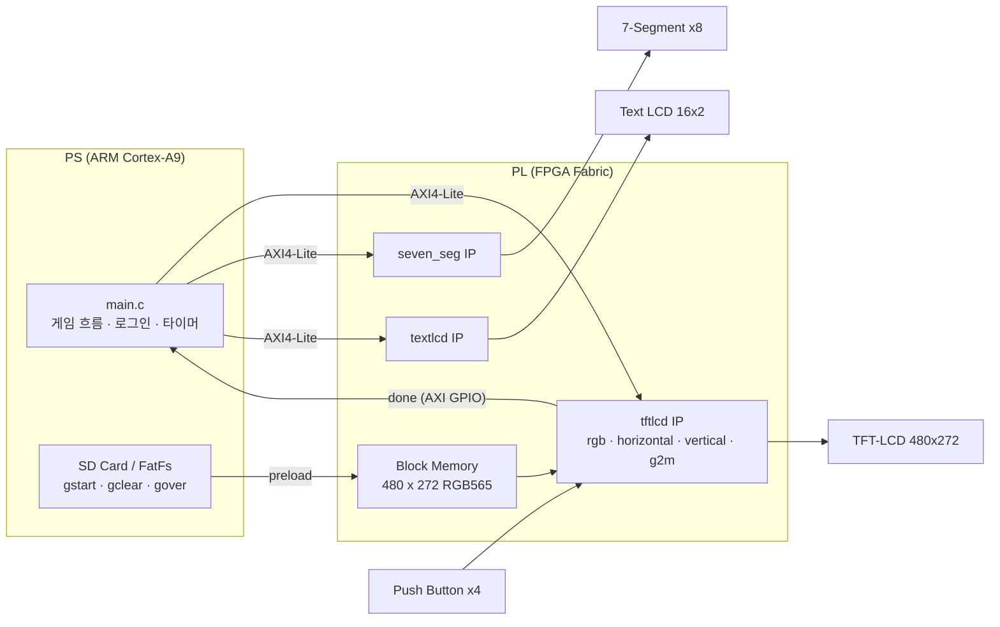

<div align="center">

# 🎨 그림 색칠하기 게임 (Shape Coloring Game)

**Zynq-7000 SoC 기반 하드웨어 가속 색칠 게임 플랫폼**

<!-- 로고 이미지가 있다면 이 자리에 추가하세요 -->

[](https://www.xilinx.com/products/silicon-devices/soc/zynq-7000.html)
[](#-사전-요구-사항)
[](https://www.xilinx.com/support/download.html)
[](#-기술-스택)
[](#-레지스터-맵)

</div>

---

## 📖 프로젝트 개요

본 프로젝트는 **PS(Processing System)와 PL(Programmable Logic)의 역할 분담**을 실습하기 위해 제작한 임베디드 SoC 시스템입니다.

일반적인 게임 로직은 CPU 소프트웨어에서 처리하지만, 이 프로젝트는 **픽셀 단위로 반복되는 연산(도형 판별, 색칠 상태 관리, 클리어 조건 판정, 화면 타이밍 생성)을 전부 PL의 커스텀 IP에서 하드웨어로 처리**합니다. PS는 게임 흐름 제어(로그인 · 모드 선택 · 타이머 · 점수 표시)와 SD 카드 이미지 로딩만 담당하며, 둘 사이는 **AXI4-Lite** 인터페이스와 **AXI GPIO**로 통신합니다.

플레이어는 보드의 4방향 버튼으로 커서를 움직여 화면에 표시된 도형 내부를 칠하고, 도형 내부가 모두 칠해지면 PL이 `done` 신호를 발생시켜 PS가 게임 클리어를 인식합니다.



---

## ✨ 주요 기능

| # | 기능 | 설명 |
|---|------|------|
| 1 | 🕹️ **4가지 게임 모드** | `square`(사각형) · `circle`(원) · `grapes`(포도) · `draw`(자유 그리기)를 UART로 선택하면 `shape_mode` 레지스터를 통해 PL이 해당 도형을 실시간 렌더링합니다. |
| 2 | 🖌️ **하드웨어 색칠 엔진** | `rgb.v`가 80×60 셀 단위 `paint[]` 배열을 유지하며, 버튼 입력에 따라 커서를 이동시키고 도형 내부일 때만 색칠 상태를 기록합니다. |
| 3 | 🏁 **자동 클리어 판정** | 매 클럭 도형 내부 전 영역의 색칠 여부를 검사해 완료 시 `done=1`을 출력하고, AXI GPIO를 통해 PS가 이를 감지합니다. |
| 4 | ⏱️ **타이머 · 점수 출력** | 모드별 제한 시간(60/90/120초)을 7-Segment(`mm:ss` + 점수)와 Text LCD에 동시에 표시하며, 시간 초과 시 Game Over 처리합니다. |
| 5 | 🖼️ **SD 카드 이미지 표시** | FatFs로 읽은 RGB565 이미지(`gstart.bin`, `gclear.bin`, `gover.bin`)를 PS가 Block Memory에 preload하고, `mode` 레지스터로 도형 화면 ↔ 이미지 화면을 전환합니다. |
| 6 | 🔐 **UART 로그인** | 시리얼 터미널로 ID/PW를 입력받고, 입력 중인 문자를 Text LCD에 실시간으로 미러링합니다. |

---

## 🛠 기술 스택

**Hardware / RTL**
- Verilog HDL (커스텀 AXI4-Lite IP 3종: `tftlcd`, `textlcd`, `seven_seg`)
- Xilinx Vivado 2019.1 (IP Packager, IP Integrator Block Design)
- Xilinx IP: `processing_system7`, `axi_interconnect`, `axi_gpio`, `blk_mem_gen`

**Software (Bare-metal)**
- C (Xilinx SDK 2019.1, standalone BSP)
- Xilinx 드라이버: `xgpio`, `xuartps`, `xiicps`, `xilffs`(FatFs)
- 자체 작성 드라이버: `tftlcd.c/h`, `textlcd.c/h`, `seven_seg.c/h`

**Target**
- Zynq-7000 `xc7z020clg484-1` / 입력 클럭 25 MHz (`create_clock -period 40`)
- 주변장치: TFT-LCD 480×272(RGB565), Text LCD 16×2, 7-Segment ×8, Push Button ×4, SD Card, PS UART1

---

## 🚀 시작하기 (Getting Started)

### 📋 사전 요구 사항

| 항목 | 요구 사항 |
|------|-----------|
| 개발 툴 | Vivado 2019.1 + Xilinx SDK 2019.1 (프로젝트가 2019.1로 생성됨) |
| 타깃 디바이스 | `xc7z020clg484-1` (핀 배치는 [top.xdc](teamp1/teamp1.srcs/constrs_1/imports/teamproj/top.xdc) 기준) |
| 주변장치 | TFT-LCD(480×272), Text LCD, 7-Segment, 4방향 버튼이 연결된 확장 보드 |
| SD 카드 | FAT 포맷 후 루트에 `gstart.bin`, `gclear.bin`, `gover.bin` 배치 (RGB565, 240×272 워드 = 65,280 words) |
| 터미널 | PS UART1에 연결된 시리얼 터미널 프로그램 (Tera Term, PuTTY 등) |

> ⚠️ **이미지 파일 안내**: `*.bin` 이미지는 용량 문제로 저장소에 포함되어 있지 않습니다. `load_image_from_sdcard()`는 정확히 `4 × 65,280` 바이트를 읽으므로, 동일한 크기의 RGB565 바이너리를 준비해야 합니다.

### 🔧 1. 하드웨어 빌드

```bash
git clone https://github.com/hiyeonwhy/soc_project.git
cd soc_project
```

Vivado에서 아래 순서로 진행합니다.

1. `teamp1/teamp1.xpr` 열기
2. **Settings → IP → Repository** 에 저장소의 `ip_repo/` 경로 추가 (`tftlcd`, `textlcd`, `seven_seg` IP 인식)
3. **Generate Bitstream** 실행
4. **File → Export → Export Hardware** (`Include bitstream` 체크)
5. **File → Launch SDK**

> 💡 이미 빌드된 결과물이 저장소에 포함되어 있습니다. 재합성 없이 바로 사용하려면
> [system_wrapper.bit](teamp1/teamp1.runs/impl_1/system_wrapper.bit) 과
> [system_wrapper.hdf](teamp1/teamp1.sdk/system_wrapper.hdf) 를 그대로 사용하면 됩니다.

### 💻 2. 소프트웨어 빌드 및 실행

1. Xilinx SDK 워크스페이스를 `teamp1/teamp1.sdk` 로 지정
2. `system_wrapper_hw_platform_0`(HW 플랫폼), `tebf_bsp`(BSP), `tebf`(애플리케이션) 프로젝트 확인
   - BSP의 `xilffs` 라이브러리가 활성화되어 있어야 SD 카드 접근이 가능합니다.
3. **Project → Build All**
4. **Xilinx → Program FPGA** 로 비트스트림 다운로드
5. `tebf` 프로젝트 우클릭 → **Run As → Launch on Hardware (System Debugger)**

---

## 🎮 사용법 (Usage)

### ① 로그인

전원을 켜면 TFT-LCD에 `gstart.bin` 시작 화면이 표시되고, 터미널에 로그인 프롬프트가 나타납니다.
입력하는 ID는 Text LCD 1행에 실시간으로 표시됩니다.

```text
================ LOGIN ================
Enter your ID: soc1234
Enter your Password: 123456789
Login Success!
```

> 🔑 계정 정보는 데모용으로 [main.c](teamp1/teamp1.sdk/tebf/src/main.c#L96-L101)에 하드코딩되어 있습니다 (`soc1234` / `123456789`).

### ② 게임 모드 선택

```text
Shape Coloring Game Started.
Select Game Level (square / circle / grapes / draw):
>circle
Shape set to: circle
Fill the shape completely to clear the game.
```

| 입력 | `shape_mode` | 도형 | 제한 시간 |
|------|--------------|------|-----------|
| `square` | `2'b00` | 사각형 | 60초 |
| `circle` | `2'b01` | 원 | 90초 |
| `grapes` | `2'b10` | 포도(원 6개) | 120초 |
| `draw`   | `2'b11` | 자유 그리기 (경계 없음) | 타이머 미사용 |

### ③ 플레이

- **4방향 버튼(Left / Right / Up / Down)** 으로 흰색 커서를 이동합니다.
- 커서가 도형 **내부**에 있으면 해당 셀이 자홍색으로 칠해집니다. 도형 **테두리(초록색)** 는 칠해지지 않습니다.
- 내부가 모두 칠해지면 PL이 `done=1`을 출력하고, PS가 이를 감지해 클리어 화면(`gclear.bin`)을 표시합니다.

```text
Game Clear Detected!      →  Text LCD: "Game Clear!" / "Game Score: 1"
Game Over!                →  시간 초과 시 gover.bin 표시
```

- `draw` 모드에서는 자유롭게 그린 뒤, 터미널에 `complete` 를 입력하면 종료됩니다.

```text
Draw mode! Type 'complete' to finish.
complete
Draw Mode: Game Complete!
```

### ④ 상태 표시 요약

| 출력 장치 | 표시 내용 |
|-----------|-----------|
| **TFT-LCD** | 도형 / 커서 / 색칠 상태, 또는 SD 카드 이미지 |
| **Text LCD (16×2)** | 1행 `Time mm:ss`, 2행 `Shape: <모드>` 및 결과 메시지 |
| **7-Segment (8자리)** | 상위 4자리 `mm:ss`, 하위 4자리 점수 |
| **LED (`done`)** | 클리어 판정 신호 |

---

## 🧾 레지스터 맵

블록 디자인([system_bd.tcl](teamp1/teamp1.srcs/sources_1/bd/system/hw_handoff/system_bd.tcl#L404-L407))에 할당된 주소입니다. 소프트웨어에서는 `xparameters.h`의 `XPAR_*_BASEADDR` 매크로 사용을 권장합니다.

| IP | Base Address | Range | 오프셋 | 기능 |
|----|--------------|-------|--------|------|
| `tftlcd_0` | `0x43C0_0000` | 512 KB | `+0x0000` | `slv_reg0[1:0]` = **mode** (0: 도형 렌더링, 1: SD 이미지) |
| | | | `+0x0004` | `slv_reg1[1:0]` = **shape_mode** (도형 선택) |
| | | | `+0x4000` | 이미지 Block Memory 영역 (RGB565 write) |
| `textlcd_0` | `0x43C8_0000` | 64 KB | `+0x00` ~ `+0x1C` | 1행/2행 각 16자를 4바이트씩 8개 레지스터로 전달 |
| `seven_seg_0` | `0x43C9_0000` | 64 KB | `+0x00` | 32비트를 4비트씩 8자리로 분해해 표시 |
| `axi_gpio_0` | `0x4120_0000` | 64 KB | `+0x00` | 채널 1 입력 = **done** (게임 클리어 신호) |

---

## 📁 폴더 구조

```text
soc_project/
├── ip_repo/                        # 커스텀 AXI4-Lite IP 저장소 (Vivado IP Repository)
│   ├── tftlcd_1.0/                 # 🎨 게임 코어 IP
│   │   ├── hdl/
│   │   │   ├── tftlcd_v1_0.v           # IP 최상위
│   │   │   └── tftlcd_v1_0_S00_AXI.v   # AXI4-Lite 슬레이브 + Block Memory 인터페이스
│   │   ├── src/
│   │   │   ├── TFTLCDCtrl.v            # 서브모듈 통합 및 mode별 RGB 먹싱
│   │   │   ├── rgb.v                   # 도형 판별 · paint[] 관리 · done 판정
│   │   │   ├── horizontal.v            # Hsync / hDE 생성
│   │   │   ├── vertical.v              # Vsync / vDE 생성
│   │   │   ├── g2m.v                   # 픽셀 클럭(opclk) 생성
│   │   │   └── blk_mem/                # Block Memory Generator IP
│   │   ├── drivers/                    # SDK용 C 드라이버
│   │   └── example_designs/            # BFM 시뮬레이션 · 하드웨어 디버그 예제
│   ├── textlcd_1.0/                # 📟 Text LCD 16x2 제어 IP
│   └── seven_seg_1.0/              # 🔢 7-Segment 8자리 제어 IP
│
├── teamp1/                         # Vivado 프로젝트
│   ├── teamp1.xpr                      # 프로젝트 파일 (진입점)
│   ├── teamp1.srcs/
│   │   ├── constrs_1/…/top.xdc         # 핀 배치 · 클럭 제약 (25 MHz)
│   │   └── sources_1/bd/system/        # 블록 디자인 (PS7 + 커스텀 IP + GPIO)
│   ├── teamp1.runs/impl_1/             # 합성/구현 결과 (system_wrapper.bit 포함)
│   └── teamp1.sdk/
│       ├── system_wrapper.hdf          # SDK 하드웨어 핸드오프
│       ├── system_wrapper_hw_platform_0/
│       ├── tebf/src/main.c             # ⭐ 애플리케이션 메인 로직
│       └── tebf_bsp/                   # standalone BSP (xilffs 포함)
│
└── README.md
```

